# Every action, and what it takes

Prompt version 16. Each plan lists, numbered, the actions a villager can do then; this file shows,
for every action in the game, what puts it on that list. How plans fit into a day and an hour is in
[day_flow.md](day_flow.md), and the code is `options.py`.

Each action is a small graph:
- **green:** the action
- **blue, "needs in pockets":** what has to be in their pockets when they plan
- **orange, "done at":** where it happens; always somewhere they can walk to with the ladder and
  vaulting pole they carry, from where they are (the way is the same in both directions, so this
  holds wherever the plan takes them)
- **yellow, "only if":** anything else that has to be true when they plan

If any of these is missing, the action isn't on that plan's list; it shows up at a later plan once
everything is there. "One line per ..." means the list has a separate numbered line for each one
(each rock, each villager, each thing in stock). Above each graph is an example of the line the
villager sees, and below it what can still make it fail when its hour comes: something that changed
after the plan was made. Any action away from home can also fail if a ladder or vaulting pole broke
on an earlier trip and the place is now out of reach.

The list is in the order of this file. The 40 entries are 35 kinds of action (`fish` has a second
entry for fishing with bait, and `buy` has four: things, tools, recipe cards and clothes) plus the
plaza, which takes the hour but isn't one of the day's actions. Proposing bridges and stairs, and a
fund for each, are from prompt version 17; everything else from 16.

One action can fail on where the villager is rather than on the plan: a proposal is made where they
stand at that hour, so it's on the list whenever a workable spot exists somewhere they can walk to,
and fails if there's none within 8 steps of where the plan has taken them by then (saying where the
nearest one is). From the moment a bridge or stairs is proposed, its whole footprint is a
construction site: walkable, but nothing can be planted or put on it, and no tree or rock turns up
there; that's why plant and place can't use those tiles.

## Gathering

### 1. `mine_rock`

On the list: *mine rock 3 (lower ground, centre)*

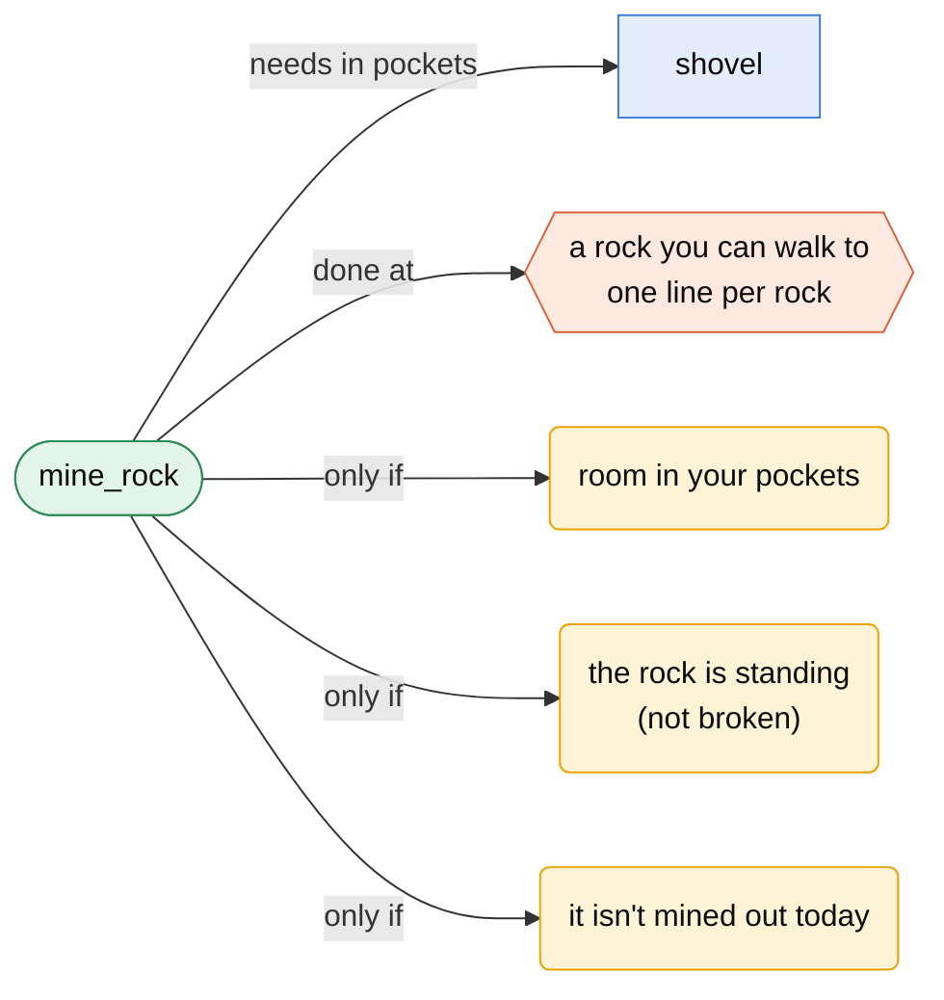
```mermaid
flowchart LR
    classDef act fill:#e3f4e8,stroke:#2e8b57,color:#0b0b0b
    classDef item fill:#e3edfb,stroke:#3d7bd9,color:#0b0b0b
    classDef place fill:#fde9df,stroke:#d9623d,color:#0b0b0b
    classDef cond fill:#fdf3d6,stroke:#eda100,color:#0b0b0b
    A(["mine_rock"])
    A -- "needs in pockets" --> I0["shovel"]
    A -- "done at" --> P0{{"a rock you can walk to<br/>one line per rock"}}
    A -- "only if" --> C0("room in your pockets")
    A -- "only if" --> C1("the rock is standing<br/>(not broken)")
    A -- "only if" --> C2("it isn't mined out today")
    class A act
    class I0 item
    class P0 place
    class C0,C1,C2 cond
```

Can still fail when its hour comes: someone mined it out first; pockets full.

### 2. `break_rock`

On the list: *break rock 3 (lower ground, centre), eating 1 apple to be strong enough*

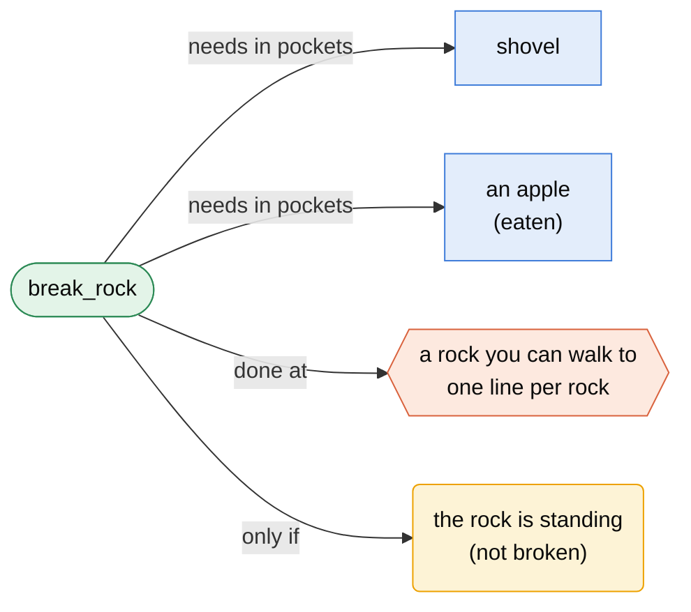
```mermaid
flowchart LR
    classDef act fill:#e3f4e8,stroke:#2e8b57,color:#0b0b0b
    classDef item fill:#e3edfb,stroke:#3d7bd9,color:#0b0b0b
    classDef place fill:#fde9df,stroke:#d9623d,color:#0b0b0b
    classDef cond fill:#fdf3d6,stroke:#eda100,color:#0b0b0b
    A(["break_rock"])
    A -- "needs in pockets" --> I0["shovel"]
    A -- "needs in pockets" --> I1["an apple<br/>(eaten)"]
    A -- "done at" --> P0{{"a rock you can walk to<br/>one line per rock"}}
    A -- "only if" --> C0("the rock is standing<br/>(not broken)")
    class A act
    class I0,I1 item
    class P0 place
    class C0 cond
```

Can still fail when its hour comes: someone broke it first; the apple is gone.

### 3. `chop_wood`

On the list: *chop wood from a hardwood tree with the axe (the axe brings the tree down when it takes its last wood)*

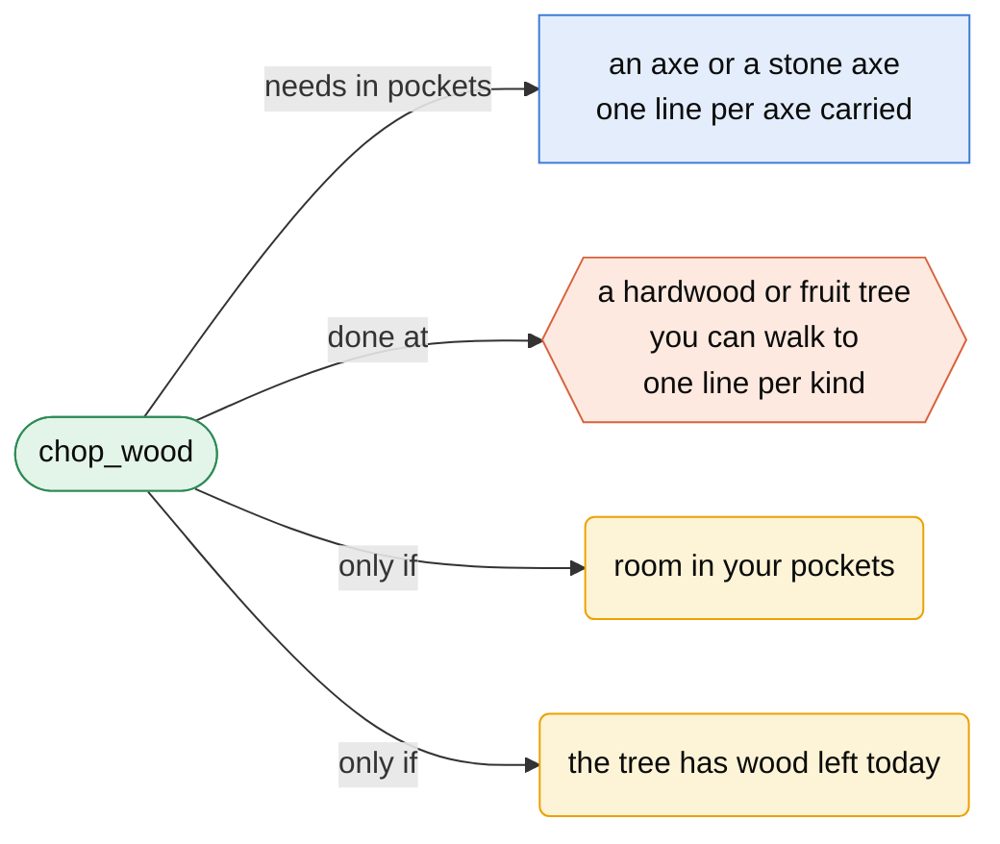
```mermaid
flowchart LR
    classDef act fill:#e3f4e8,stroke:#2e8b57,color:#0b0b0b
    classDef item fill:#e3edfb,stroke:#3d7bd9,color:#0b0b0b
    classDef place fill:#fde9df,stroke:#d9623d,color:#0b0b0b
    classDef cond fill:#fdf3d6,stroke:#eda100,color:#0b0b0b
    A(["chop_wood"])
    A -- "needs in pockets" --> I0["an axe or a stone axe<br/>one line per axe carried"]
    A -- "done at" --> P0{{"a hardwood or fruit tree<br/>you can walk to<br/>one line per kind"}}
    A -- "only if" --> C0("room in your pockets")
    A -- "only if" --> C1("the tree has wood left today")
    class A act
    class I0 item
    class P0 place
    class C0,C1 cond
```

Can still fail when its hour comes: the wood was taken first; pockets full.

### 4. `shake_tree`

On the list: *shake a fruit tree*

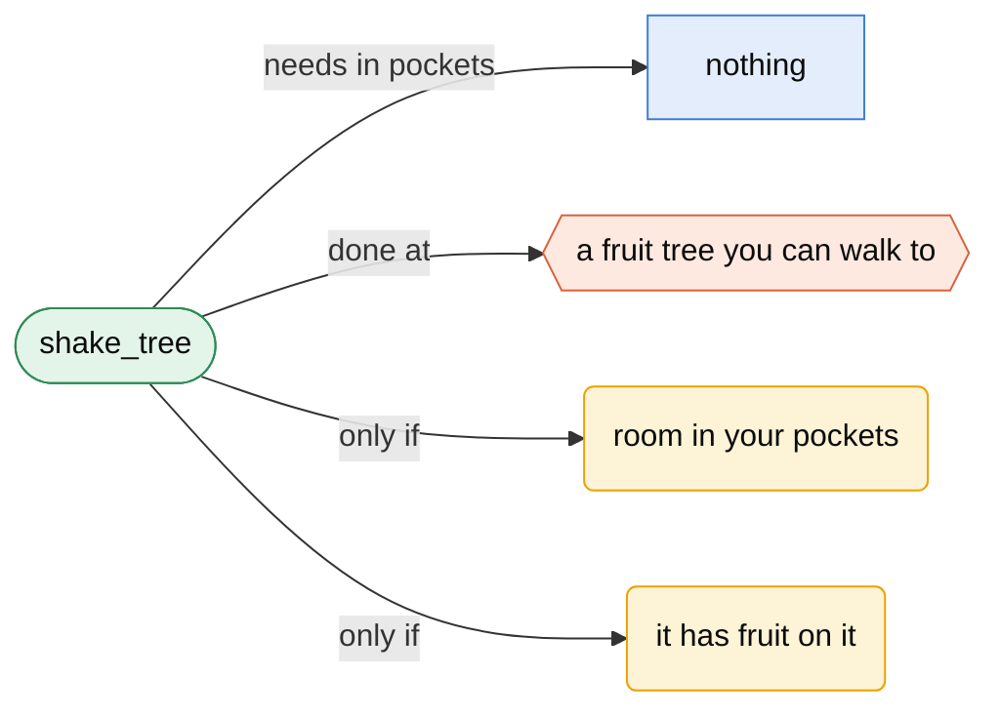
```mermaid
flowchart LR
    classDef act fill:#e3f4e8,stroke:#2e8b57,color:#0b0b0b
    classDef item fill:#e3edfb,stroke:#3d7bd9,color:#0b0b0b
    classDef place fill:#fde9df,stroke:#d9623d,color:#0b0b0b
    classDef cond fill:#fdf3d6,stroke:#eda100,color:#0b0b0b
    A(["shake_tree"])
    A -- "needs in pockets" --> I0["nothing"]
    A -- "done at" --> P0{{"a fruit tree you can walk to"}}
    A -- "only if" --> C0("room in your pockets")
    A -- "only if" --> C1("it has fruit on it")
    class A act
    class I0 item
    class P0 place
    class C0,C1 cond
```

Can still fail when its hour comes: the fruit was taken first; pockets full.

### 5. `fish`

On the list: *fish in the river*

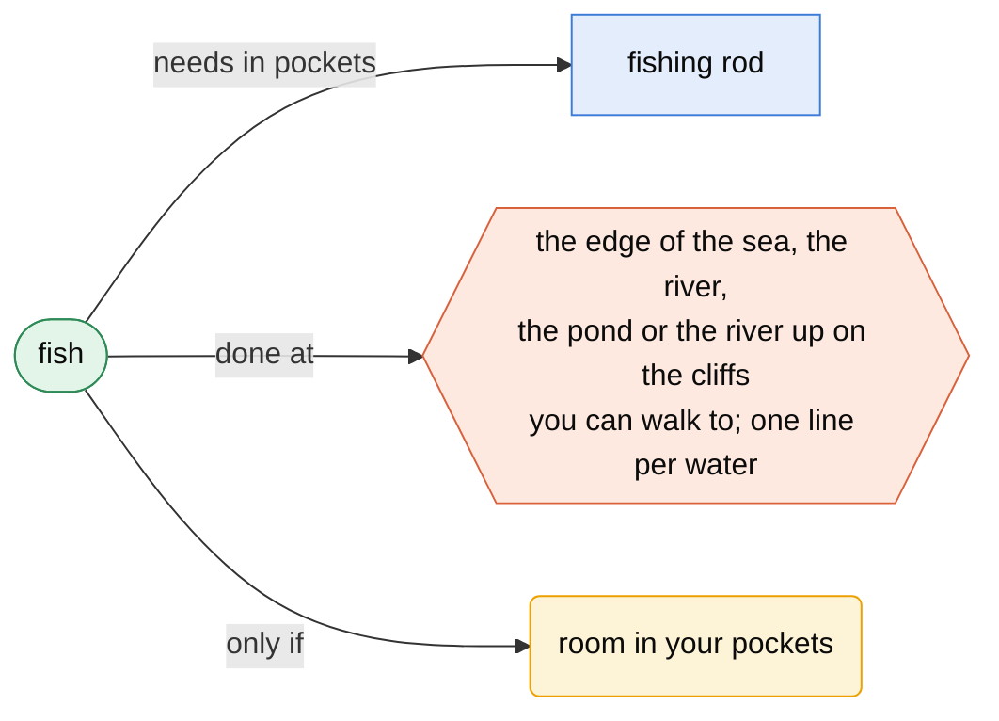
```mermaid
flowchart LR
    classDef act fill:#e3f4e8,stroke:#2e8b57,color:#0b0b0b
    classDef item fill:#e3edfb,stroke:#3d7bd9,color:#0b0b0b
    classDef place fill:#fde9df,stroke:#d9623d,color:#0b0b0b
    classDef cond fill:#fdf3d6,stroke:#eda100,color:#0b0b0b
    A(["fish"])
    A -- "needs in pockets" --> I0["fishing rod"]
    A -- "done at" --> P0{{"the edge of the sea, the river,<br/>the pond or the river up on the cliffs<br/>you can walk to; one line per water"}}
    A -- "only if" --> C0("room in your pockets")
    class A act
    class I0 item
    class P0 place
    class C0 cond
```

Can still fail when its hour comes: pockets full; the rod broke.

### 6. `fish (with bait)`

On the list: *fish in the river with fishing bait (uses 1; you carry 2)*

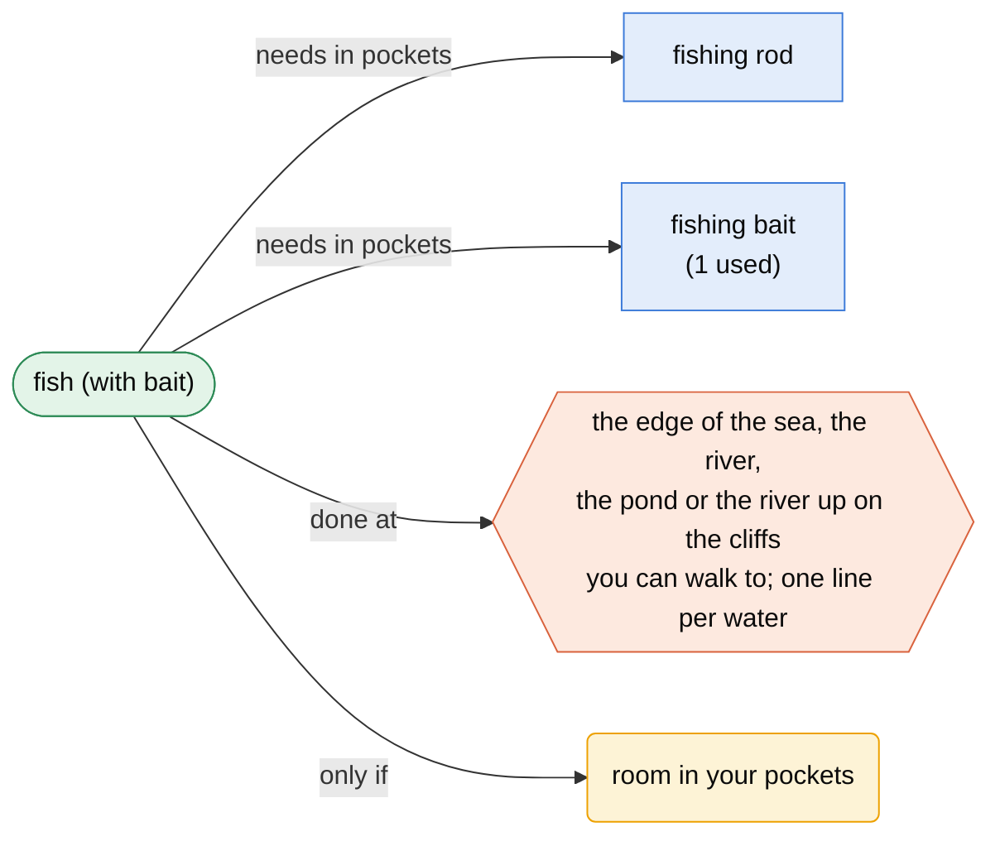
```mermaid
flowchart LR
    classDef act fill:#e3f4e8,stroke:#2e8b57,color:#0b0b0b
    classDef item fill:#e3edfb,stroke:#3d7bd9,color:#0b0b0b
    classDef place fill:#fde9df,stroke:#d9623d,color:#0b0b0b
    classDef cond fill:#fdf3d6,stroke:#eda100,color:#0b0b0b
    A(["fish (with bait)"])
    A -- "needs in pockets" --> I0["fishing rod"]
    A -- "needs in pockets" --> I1["fishing bait<br/>(1 used)"]
    A -- "done at" --> P0{{"the edge of the sea, the river,<br/>the pond or the river up on the cliffs<br/>you can walk to; one line per water"}}
    A -- "only if" --> C0("room in your pockets")
    class A act
    class I0,I1 item
    class P0 place
    class C0 cond
```

Can still fail when its hour comes: pockets full; the rod broke (with the bait gone, they fish without it and are told so).

### 7. `catch_bug`

On the list: *catch bugs among the flowers*

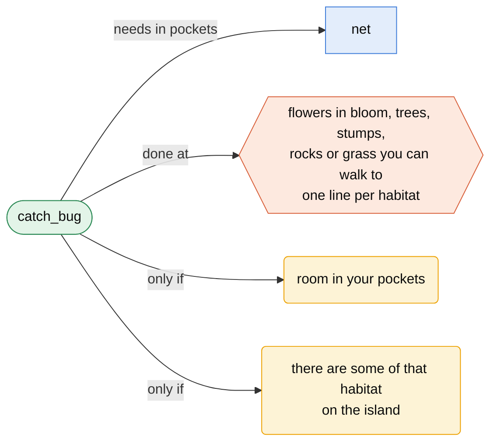
```mermaid
flowchart LR
    classDef act fill:#e3f4e8,stroke:#2e8b57,color:#0b0b0b
    classDef item fill:#e3edfb,stroke:#3d7bd9,color:#0b0b0b
    classDef place fill:#fde9df,stroke:#d9623d,color:#0b0b0b
    classDef cond fill:#fdf3d6,stroke:#eda100,color:#0b0b0b
    A(["catch_bug"])
    A -- "needs in pockets" --> I0["net"]
    A -- "done at" --> P0{{"flowers in bloom, trees, stumps,<br/>rocks or grass you can walk to<br/>one line per habitat"}}
    A -- "only if" --> C0("room in your pockets")
    A -- "only if" --> C1("there are some of that habitat<br/>on the island")
    class A act
    class I0 item
    class P0 place
    class C0,C1 cond
```

Can still fail when its hour comes: pockets full; the net broke.

### 8. `beachcomb`

On the list: *beachcomb*

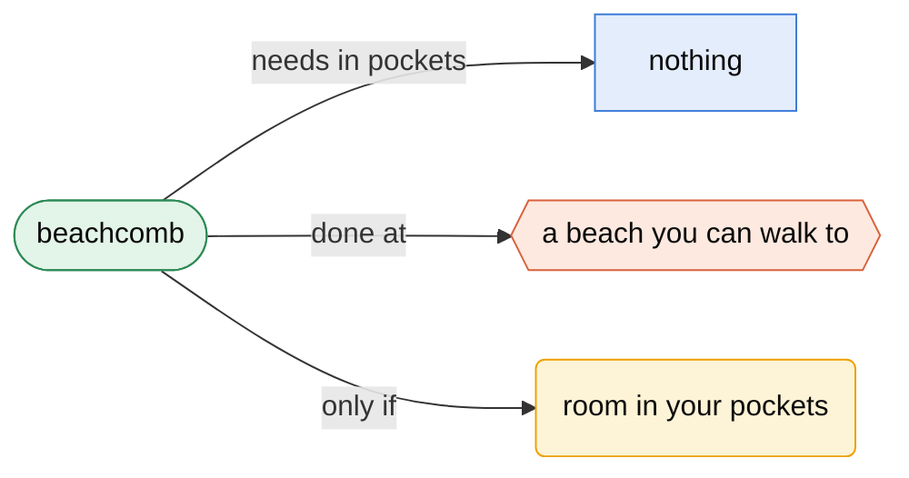
```mermaid
flowchart LR
    classDef act fill:#e3f4e8,stroke:#2e8b57,color:#0b0b0b
    classDef item fill:#e3edfb,stroke:#3d7bd9,color:#0b0b0b
    classDef place fill:#fde9df,stroke:#d9623d,color:#0b0b0b
    classDef cond fill:#fdf3d6,stroke:#eda100,color:#0b0b0b
    A(["beachcomb"])
    A -- "needs in pockets" --> I0["nothing"]
    A -- "done at" --> P0{{"a beach you can walk to"}}
    A -- "only if" --> C0("room in your pockets")
    class A act
    class I0 item
    class P0 place
    class C0 cond
```

Can still fail when its hour comes: nothing: a picked-clean beach is still an hour on the beach.

### 9. `dig_fossil`

On the list: *dig for fossils*

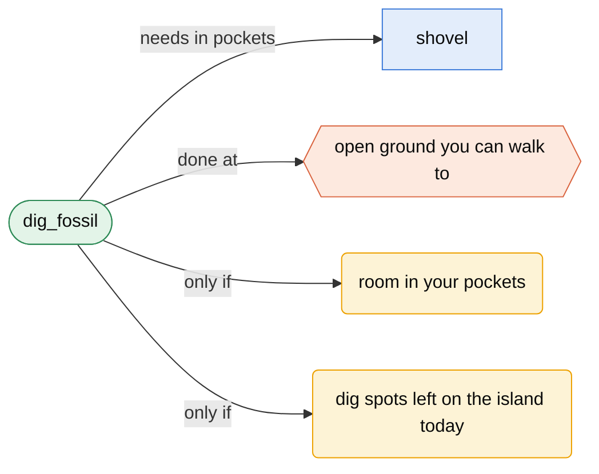
```mermaid
flowchart LR
    classDef act fill:#e3f4e8,stroke:#2e8b57,color:#0b0b0b
    classDef item fill:#e3edfb,stroke:#3d7bd9,color:#0b0b0b
    classDef place fill:#fde9df,stroke:#d9623d,color:#0b0b0b
    classDef cond fill:#fdf3d6,stroke:#eda100,color:#0b0b0b
    A(["dig_fossil"])
    A -- "needs in pockets" --> I0["shovel"]
    A -- "done at" --> P0{{"open ground you can walk to"}}
    A -- "only if" --> C0("room in your pockets")
    A -- "only if" --> C1("dig spots left on the island today")
    class A act
    class I0 item
    class P0 place
    class C0,C1 cond
```

Can still fail when its hour comes: the last spots were dug first; pockets full.

### 10. `dig_clam`

On the list: *dig for manila clams on the beach*

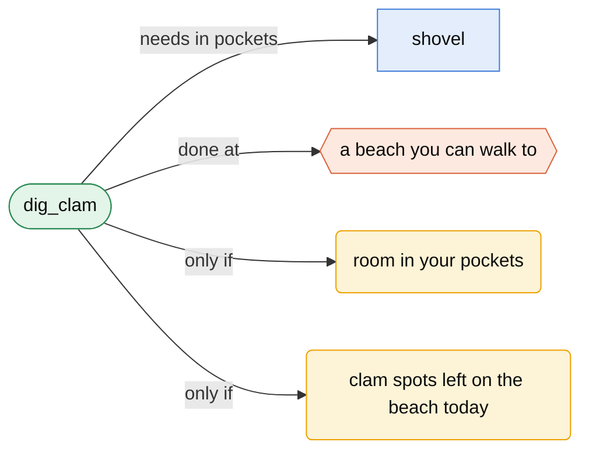
```mermaid
flowchart LR
    classDef act fill:#e3f4e8,stroke:#2e8b57,color:#0b0b0b
    classDef item fill:#e3edfb,stroke:#3d7bd9,color:#0b0b0b
    classDef place fill:#fde9df,stroke:#d9623d,color:#0b0b0b
    classDef cond fill:#fdf3d6,stroke:#eda100,color:#0b0b0b
    A(["dig_clam"])
    A -- "needs in pockets" --> I0["shovel"]
    A -- "done at" --> P0{{"a beach you can walk to"}}
    A -- "only if" --> C0("room in your pockets")
    A -- "only if" --> C1("clam spots left on the beach today")
    class A act
    class I0 item
    class P0 place
    class C0,C1 cond
```

Can still fail when its hour comes: the last spots were dug first; pockets full.

### 11. `dig_stump`

On the list: *dig up a stump*

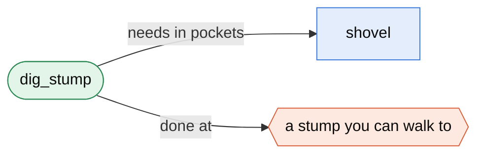
```mermaid
flowchart LR
    classDef act fill:#e3f4e8,stroke:#2e8b57,color:#0b0b0b
    classDef item fill:#e3edfb,stroke:#3d7bd9,color:#0b0b0b
    classDef place fill:#fde9df,stroke:#d9623d,color:#0b0b0b
    classDef cond fill:#fdf3d6,stroke:#eda100,color:#0b0b0b
    A(["dig_stump"])
    A -- "needs in pockets" --> I0["shovel"]
    A -- "done at" --> P0{{"a stump you can walk to"}}
    class A act
    class I0 item
    class P0 place
```

Can still fail when its hour comes: someone dug it up first.

## Bridges and stairs (from prompt version 17)

### 12. `propose_bridge`

On the list: *propose a bridge across the river, at the nearest spot within 8 steps of where you are then (built once 98000 bells are donated at Resident Services; 2 of 10 on the island so far)*

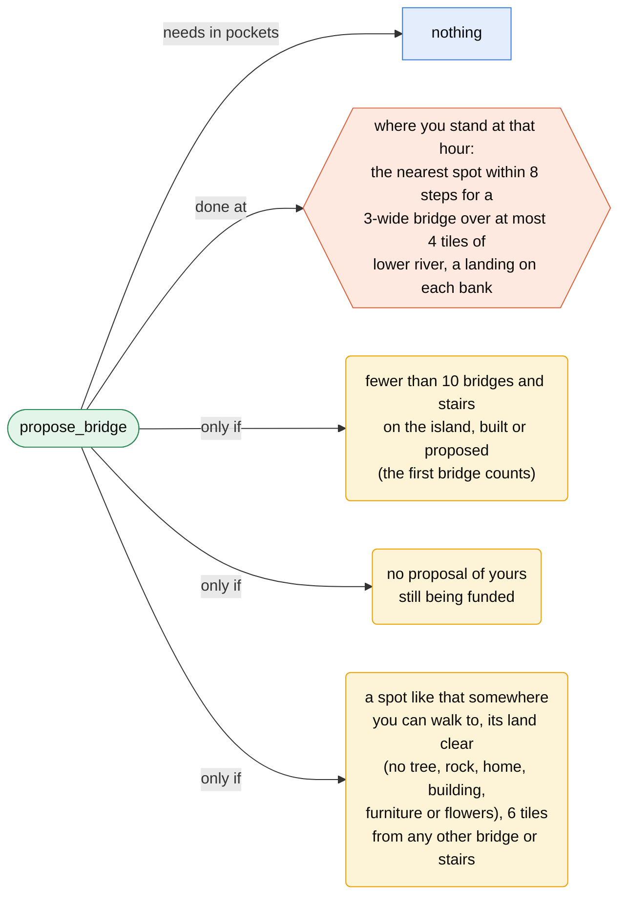
```mermaid
flowchart LR
    classDef act fill:#e3f4e8,stroke:#2e8b57,color:#0b0b0b
    classDef item fill:#e3edfb,stroke:#3d7bd9,color:#0b0b0b
    classDef place fill:#fde9df,stroke:#d9623d,color:#0b0b0b
    classDef cond fill:#fdf3d6,stroke:#eda100,color:#0b0b0b
    A(["propose_bridge"])
    A -- "needs in pockets" --> I0["nothing"]
    A -- "done at" --> P0{{"where you stand at that hour:<br/>the nearest spot within 8 steps for a<br/>3-wide bridge over at most 4 tiles of<br/>lower river, a landing on each bank"}}
    A -- "only if" --> C0("fewer than 10 bridges and stairs<br/>on the island, built or proposed<br/>(the first bridge counts)")
    A -- "only if" --> C1("no proposal of yours<br/>still being funded")
    A -- "only if" --> C2("a spot like that somewhere<br/>you can walk to, its land clear<br/>(no tree, rock, home, building,<br/>furniture or flowers), 6 tiles<br/>from any other bridge or stairs")
    class A act
    class I0 item
    class P0 place
    class C0,C1,C2 cond
```

Can still fail when its hour comes: there's no such spot within 8 steps of where you are then.

### 13. `propose_stairs`

On the list: *propose stairs up a cliff, at the nearest spot within 8 steps of where you are then (built once 98000 bells are donated at Resident Services; 2 of 10 on the island so far)*

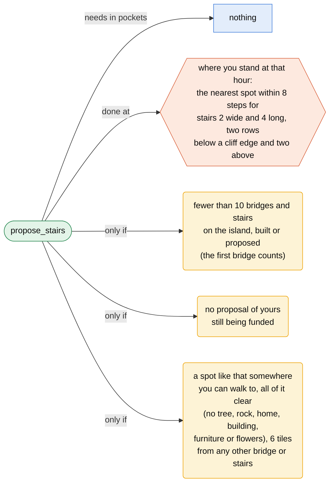
```mermaid
flowchart LR
    classDef act fill:#e3f4e8,stroke:#2e8b57,color:#0b0b0b
    classDef item fill:#e3edfb,stroke:#3d7bd9,color:#0b0b0b
    classDef place fill:#fde9df,stroke:#d9623d,color:#0b0b0b
    classDef cond fill:#fdf3d6,stroke:#eda100,color:#0b0b0b
    A(["propose_stairs"])
    A -- "needs in pockets" --> I0["nothing"]
    A -- "done at" --> P0{{"where you stand at that hour:<br/>the nearest spot within 8 steps for<br/>stairs 2 wide and 4 long, two rows<br/>below a cliff edge and two above"}}
    A -- "only if" --> C0("fewer than 10 bridges and stairs<br/>on the island, built or proposed<br/>(the first bridge counts)")
    A -- "only if" --> C1("no proposal of yours<br/>still being funded")
    A -- "only if" --> C2("a spot like that somewhere<br/>you can walk to, all of it clear<br/>(no tree, rock, home, building,<br/>furniture or flowers), 6 tiles<br/>from any other bridge or stairs")
    class A act
    class I0 item
    class P0 place
    class C0,C1,C2 cond
```

Can still fail when its hour comes: there's no such spot within 8 steps of where you are then.

## Outside

### 14. `plant`

On the list: *plant an apple (you carry 3); add "near": a place*

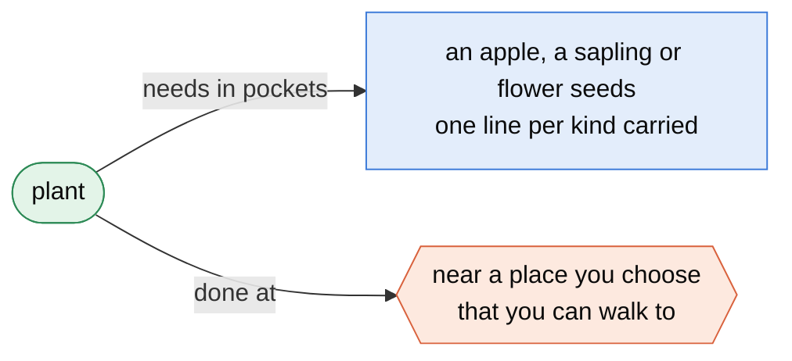
```mermaid
flowchart LR
    classDef act fill:#e3f4e8,stroke:#2e8b57,color:#0b0b0b
    classDef item fill:#e3edfb,stroke:#3d7bd9,color:#0b0b0b
    classDef place fill:#fde9df,stroke:#d9623d,color:#0b0b0b
    classDef cond fill:#fdf3d6,stroke:#eda100,color:#0b0b0b
    A(["plant"])
    A -- "needs in pockets" --> I0["an apple, a sapling or flower seeds<br/>one line per kind carried"]
    A -- "done at" --> P0{{"near a place you choose<br/>that you can walk to"}}
    class A act
    class I0 item
    class P0 place
```

Can still fail when its hour comes: no free spot near there.

### 15. `place`

On the list: *put the log stool outside (you carry 1); add "near": a place*

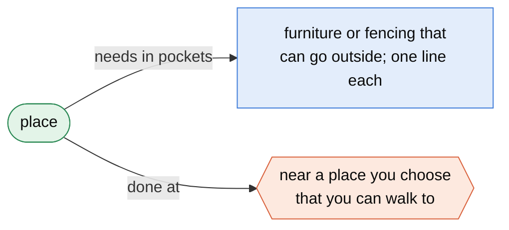
```mermaid
flowchart LR
    classDef act fill:#e3f4e8,stroke:#2e8b57,color:#0b0b0b
    classDef item fill:#e3edfb,stroke:#3d7bd9,color:#0b0b0b
    classDef place fill:#fde9df,stroke:#d9623d,color:#0b0b0b
    classDef cond fill:#fdf3d6,stroke:#eda100,color:#0b0b0b
    A(["place"])
    A -- "needs in pockets" --> I0["furniture or fencing that<br/>can go outside; one line each"]
    A -- "done at" --> P0{{"near a place you choose<br/>that you can walk to"}}
    class A act
    class I0 item
    class P0 place
```

Can still fail when its hour comes: no free space near there.

### 16. `fence_off`

On the list: *fence off around your home with simple wooden fence (you carry 5; one piece per tile)*

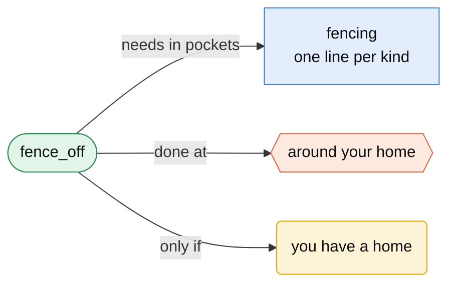
```mermaid
flowchart LR
    classDef act fill:#e3f4e8,stroke:#2e8b57,color:#0b0b0b
    classDef item fill:#e3edfb,stroke:#3d7bd9,color:#0b0b0b
    classDef place fill:#fde9df,stroke:#d9623d,color:#0b0b0b
    classDef cond fill:#fdf3d6,stroke:#eda100,color:#0b0b0b
    A(["fence_off"])
    A -- "needs in pockets" --> I0["fencing<br/>one line per kind"]
    A -- "done at" --> P0{{"around your home"}}
    A -- "only if" --> C0("you have a home")
    class A act
    class I0 item
    class P0 place
    class C0 cond
```

Can still fail when its hour comes: nothing left to fence there.

### 17. `pick_up`

On the list: *pick up log stool you put outside (lower ground, centre) (1 out)*

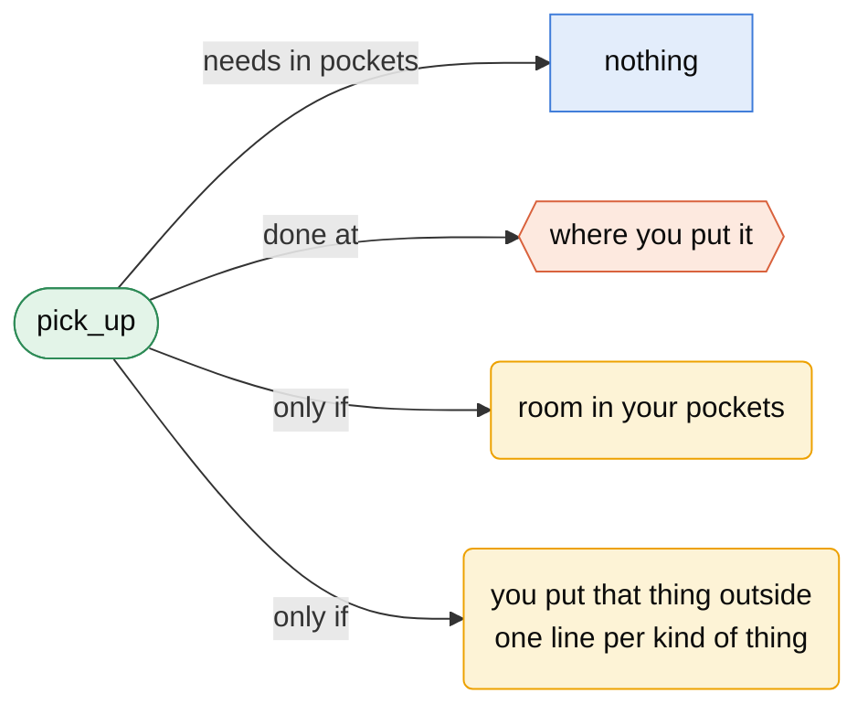
```mermaid
flowchart LR
    classDef act fill:#e3f4e8,stroke:#2e8b57,color:#0b0b0b
    classDef item fill:#e3edfb,stroke:#3d7bd9,color:#0b0b0b
    classDef place fill:#fde9df,stroke:#d9623d,color:#0b0b0b
    classDef cond fill:#fdf3d6,stroke:#eda100,color:#0b0b0b
    A(["pick_up"])
    A -- "needs in pockets" --> I0["nothing"]
    A -- "done at" --> P0{{"where you put it"}}
    A -- "only if" --> C0("room in your pockets")
    A -- "only if" --> C1("you put that thing outside<br/>one line per kind of thing")
    class A act
    class I0 item
    class P0 place
    class C0,C1 cond
```

Can still fail when its hour comes: pockets full.

### 18. `lay_path`

On the list: *lay a path; add "style", "from" and "to"*

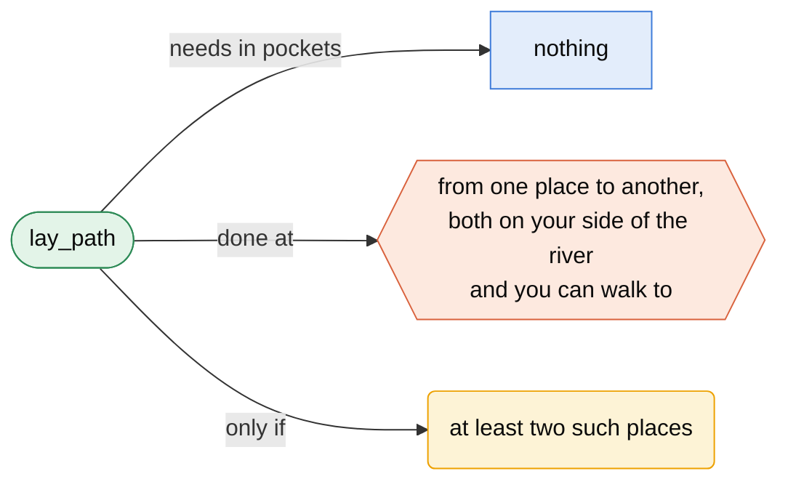
```mermaid
flowchart LR
    classDef act fill:#e3f4e8,stroke:#2e8b57,color:#0b0b0b
    classDef item fill:#e3edfb,stroke:#3d7bd9,color:#0b0b0b
    classDef place fill:#fde9df,stroke:#d9623d,color:#0b0b0b
    classDef cond fill:#fdf3d6,stroke:#eda100,color:#0b0b0b
    A(["lay_path"])
    A -- "needs in pockets" --> I0["nothing"]
    A -- "done at" --> P0{{"from one place to another,<br/>both on your side of the river<br/>and you can walk to"}}
    A -- "only if" --> C0("at least two such places")
    class A act
    class I0 item
    class P0 place
    class C0 cond
```

Can still fail when its hour comes: that stretch is already paved.

### 19. `remove_path`

On the list: *take up path tiles you laid around lower ground, centre*

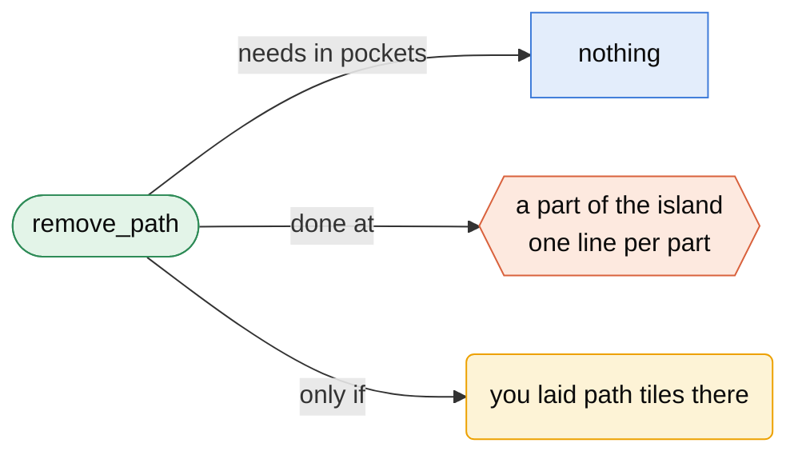
```mermaid
flowchart LR
    classDef act fill:#e3f4e8,stroke:#2e8b57,color:#0b0b0b
    classDef item fill:#e3edfb,stroke:#3d7bd9,color:#0b0b0b
    classDef place fill:#fde9df,stroke:#d9623d,color:#0b0b0b
    classDef cond fill:#fdf3d6,stroke:#eda100,color:#0b0b0b
    A(["remove_path"])
    A -- "needs in pockets" --> I0["nothing"]
    A -- "done at" --> P0{{"a part of the island<br/>one line per part"}}
    A -- "only if" --> C0("you laid path tiles there")
    class A act
    class I0 item
    class P0 place
    class C0 cond
```

Can still fail when its hour comes: they were taken up already.

## At home, and clothes

### 20. `craft`

On the list: *craft a log stool at home*

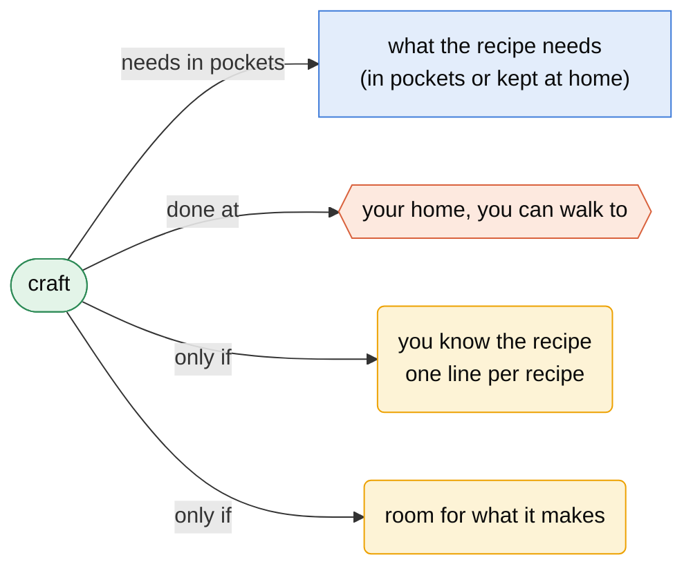
```mermaid
flowchart LR
    classDef act fill:#e3f4e8,stroke:#2e8b57,color:#0b0b0b
    classDef item fill:#e3edfb,stroke:#3d7bd9,color:#0b0b0b
    classDef place fill:#fde9df,stroke:#d9623d,color:#0b0b0b
    classDef cond fill:#fdf3d6,stroke:#eda100,color:#0b0b0b
    A(["craft"])
    A -- "needs in pockets" --> I0["what the recipe needs<br/>(in pockets or kept at home)"]
    A -- "done at" --> P0{{"your home, you can walk to"}}
    A -- "only if" --> C0("you know the recipe<br/>one line per recipe")
    A -- "only if" --> C1("room for what it makes")
    class A act
    class I0 item
    class P0 place
    class C0,C1 cond
```

Can still fail when its hour comes: materials used or given away since; pockets full.

### 21. `decorate`

On the list: *put a log stool inside your home*

```mermaid
flowchart LR
    classDef act fill:#e3f4e8,stroke:#2e8b57,color:#0b0b0b
    classDef item fill:#e3edfb,stroke:#3d7bd9,color:#0b0b0b
    classDef place fill:#fde9df,stroke:#d9623d,color:#0b0b0b
    classDef cond fill:#fdf3d6,stroke:#eda100,color:#0b0b0b
    A(["decorate"])
    A -- "needs in pockets" --> I0["the furniture<br/>one line per piece"]
    A -- "done at" --> P0{{"your home, you can walk to"}}
    A -- "only if" --> C0("room inside your house")
    class A act
    class I0 item
    class P0 place
    class C0 cond
```

Can still fail when its hour comes: it was given away or put outside since.

### 22. `undecorate`

On the list: *take the log stool out of your home*

```mermaid
flowchart LR
    classDef act fill:#e3f4e8,stroke:#2e8b57,color:#0b0b0b
    classDef item fill:#e3edfb,stroke:#3d7bd9,color:#0b0b0b
    classDef place fill:#fde9df,stroke:#d9623d,color:#0b0b0b
    classDef cond fill:#fdf3d6,stroke:#eda100,color:#0b0b0b
    A(["undecorate"])
    A -- "needs in pockets" --> I0["nothing"]
    A -- "done at" --> P0{{"your home, you can walk to"}}
    A -- "only if" --> C0("room in your pockets")
    A -- "only if" --> C1("it is inside your home<br/>one line per piece")
    class A act
    class I0 item
    class P0 place
    class C0,C1 cond
```

Can still fail when its hour comes: pockets full.

### 23. `wear`

On the list: *put on the straw hat*

```mermaid
flowchart LR
    classDef act fill:#e3f4e8,stroke:#2e8b57,color:#0b0b0b
    classDef item fill:#e3edfb,stroke:#3d7bd9,color:#0b0b0b
    classDef place fill:#fde9df,stroke:#d9623d,color:#0b0b0b
    classDef cond fill:#fdf3d6,stroke:#eda100,color:#0b0b0b
    A(["wear"])
    A -- "needs in pockets" --> I0["the clothing<br/>one line per piece"]
    A -- "done at" --> P0{{"wherever you are"}}
    class A act
    class I0 item
    class P0 place
```

Can still fail when its hour comes: it was given away since.

## Visiting

### 24. `visit`

On the list: *visit Jo at their home (lower ground, west)*

```mermaid
flowchart LR
    classDef act fill:#e3f4e8,stroke:#2e8b57,color:#0b0b0b
    classDef item fill:#e3edfb,stroke:#3d7bd9,color:#0b0b0b
    classDef place fill:#fde9df,stroke:#d9623d,color:#0b0b0b
    classDef cond fill:#fdf3d6,stroke:#eda100,color:#0b0b0b
    A(["visit"])
    A -- "needs in pockets" --> I0["nothing"]
    A -- "done at" --> P0{{"the other villager's home<br/>you can walk to; one line per villager"}}
    A -- "only if" --> C0("they have a home")
    class A act
    class I0 item
    class P0 place
    class C0 cond
```

Can't fail when its hour comes.

## Shops and services

### 25. `ask`

On the list: *ask Tom Nook what they do and what it costs (at Resident Services)*

```mermaid
flowchart LR
    classDef act fill:#e3f4e8,stroke:#2e8b57,color:#0b0b0b
    classDef item fill:#e3edfb,stroke:#3d7bd9,color:#0b0b0b
    classDef place fill:#fde9df,stroke:#d9623d,color:#0b0b0b
    classDef cond fill:#fdf3d6,stroke:#eda100,color:#0b0b0b
    A(["ask"])
    A -- "needs in pockets" --> I0["nothing"]
    A -- "done at" --> P0{{"Resident Services (Tom Nook, Isabelle),<br/>the museum (Blathers), Nook's Cranny<br/>(Timmy and Tommy) or the Able Sisters<br/>you can walk to; one line per person"}}
    A -- "only if" --> C0("it's open during the plan<br/>Nook's Cranny 08:00-22:00,<br/>Able Sisters 09:00-21:00,<br/>the others all day")
    class A act
    class I0 item
    class P0 place
    class C0 cond
```

Can't fail when its hour comes.

### 26. `sell`

On the list: *sell at Nook's Cranny; add "items": what and how many*

```mermaid
flowchart LR
    classDef act fill:#e3f4e8,stroke:#2e8b57,color:#0b0b0b
    classDef item fill:#e3edfb,stroke:#3d7bd9,color:#0b0b0b
    classDef place fill:#fde9df,stroke:#d9623d,color:#0b0b0b
    classDef cond fill:#fdf3d6,stroke:#eda100,color:#0b0b0b
    A(["sell"])
    A -- "needs in pockets" --> I0["things Timmy and Tommy buy"]
    A -- "done at" --> P0{{"Nook's Cranny, you can walk to"}}
    A -- "only if" --> C0("open during the plan<br/>08:00-22:00")
    class A act
    class I0 item
    class P0 place
    class C0 cond
```

Can still fail when its hour comes: none of it is in your pockets any more.

### 27. `buy (a thing)`

On the list: *buy fishing bait at Nook's Cranny, 300 bells each; add "count"*

```mermaid
flowchart LR
    classDef act fill:#e3f4e8,stroke:#2e8b57,color:#0b0b0b
    classDef item fill:#e3edfb,stroke:#3d7bd9,color:#0b0b0b
    classDef place fill:#fde9df,stroke:#d9623d,color:#0b0b0b
    classDef cond fill:#fdf3d6,stroke:#eda100,color:#0b0b0b
    A(["buy (a thing)"])
    A -- "needs in pockets" --> I0["bells for one<br/>(in your wallet)"]
    A -- "done at" --> P0{{"Nook's Cranny, you can walk to"}}
    A -- "only if" --> C0("open during the plan<br/>08:00-22:00")
    A -- "only if" --> C1("it's in today's stock<br/>one line per thing")
    A -- "only if" --> C2("room in your pockets")
    class A act
    class I0 item
    class P0 place
    class C0,C1,C2 cond
```

Can still fail when its hour comes: bells spent since; pockets full.

### 28. `buy (a tool)`

On the list: *buy a new shovel at Nook's Cranny, 800 bells each*

```mermaid
flowchart LR
    classDef act fill:#e3f4e8,stroke:#2e8b57,color:#0b0b0b
    classDef item fill:#e3edfb,stroke:#3d7bd9,color:#0b0b0b
    classDef place fill:#fde9df,stroke:#d9623d,color:#0b0b0b
    classDef cond fill:#fdf3d6,stroke:#eda100,color:#0b0b0b
    A(["buy (a tool)"])
    A -- "needs in pockets" --> I0["bells for one<br/>(in your wallet)"]
    A -- "done at" --> P0{{"Nook's Cranny, you can walk to"}}
    A -- "only if" --> C0("open during the plan<br/>08:00-22:00")
    A -- "only if" --> C1("one line per tool<br/>(always in stock)")
    A -- "only if" --> C2("room in your pockets")
    class A act
    class I0 item
    class P0 place
    class C0,C1,C2 cond
```

Can still fail when its hour comes: bells spent since; pockets full.

### 29. `buy (a recipe card)`

On the list: *buy the shovel recipe card at Nook's Cranny, 200 bells*

```mermaid
flowchart LR
    classDef act fill:#e3f4e8,stroke:#2e8b57,color:#0b0b0b
    classDef item fill:#e3edfb,stroke:#3d7bd9,color:#0b0b0b
    classDef place fill:#fde9df,stroke:#d9623d,color:#0b0b0b
    classDef cond fill:#fdf3d6,stroke:#eda100,color:#0b0b0b
    A(["buy (a recipe card)"])
    A -- "needs in pockets" --> I0["bells for it<br/>(in your wallet)"]
    A -- "done at" --> P0{{"Nook's Cranny, you can walk to"}}
    A -- "only if" --> C0("open during the plan<br/>08:00-22:00")
    A -- "only if" --> C1("it's for sale today<br/>(tool cards always, plus one)")
    A -- "only if" --> C2("room in your pockets,<br/>only if you already know it")
    class A act
    class I0 item
    class P0 place
    class C0,C1,C2 cond
```

Can still fail when its hour comes: bells spent since.

### 30. `buy (clothes)`

On the list: *buy the kimono at the Able Sisters, 4800 bells*

```mermaid
flowchart LR
    classDef act fill:#e3f4e8,stroke:#2e8b57,color:#0b0b0b
    classDef item fill:#e3edfb,stroke:#3d7bd9,color:#0b0b0b
    classDef place fill:#fde9df,stroke:#d9623d,color:#0b0b0b
    classDef cond fill:#fdf3d6,stroke:#eda100,color:#0b0b0b
    A(["buy (clothes)"])
    A -- "needs in pockets" --> I0["bells for it<br/>(in your wallet)"]
    A -- "done at" --> P0{{"the Able Sisters, you can walk to"}}
    A -- "only if" --> C0("open during the plan<br/>09:00-21:00")
    A -- "only if" --> C1("it's in today's stock<br/>one line per piece")
    A -- "only if" --> C2("room in your pockets")
    class A act
    class I0 item
    class P0 place
    class C0,C1,C2 cond
```

Can still fail when its hour comes: bells spent since; pockets full.

### 31. `assess`

On the list: *have Blathers assess your fossils (1) at the museum*

```mermaid
flowchart LR
    classDef act fill:#e3f4e8,stroke:#2e8b57,color:#0b0b0b
    classDef item fill:#e3edfb,stroke:#3d7bd9,color:#0b0b0b
    classDef place fill:#fde9df,stroke:#d9623d,color:#0b0b0b
    classDef cond fill:#fdf3d6,stroke:#eda100,color:#0b0b0b
    A(["assess"])
    A -- "needs in pockets" --> I0["an unassessed fossil"]
    A -- "done at" --> P0{{"the museum, you can walk to"}}
    A -- "only if" --> C0("open (all day)")
    class A act
    class I0 item
    class P0 place
    class C0 cond
```

Can still fail when its hour comes: the fossils are gone from your pockets.

### 32. `donate`

On the list: *donate a sea bass at the museum*

```mermaid
flowchart LR
    classDef act fill:#e3f4e8,stroke:#2e8b57,color:#0b0b0b
    classDef item fill:#e3edfb,stroke:#3d7bd9,color:#0b0b0b
    classDef place fill:#fde9df,stroke:#d9623d,color:#0b0b0b
    classDef cond fill:#fdf3d6,stroke:#eda100,color:#0b0b0b
    A(["donate"])
    A -- "needs in pockets" --> I0["a fish, bug or assessed fossil<br/>one line per kind"]
    A -- "done at" --> P0{{"the museum, you can walk to"}}
    A -- "only if" --> C0("open (all day)")
    A -- "only if" --> C1("the museum doesn't have one yet")
    class A act
    class I0 item
    class P0 place
    class C0,C1 cond
```

Can still fail when its hour comes: someone donated one first; it's gone from your pockets.

### 33. `upgrade_house`

On the list: *have Tom Nook upgrade your tent at Resident Services*

```mermaid
flowchart LR
    classDef act fill:#e3f4e8,stroke:#2e8b57,color:#0b0b0b
    classDef item fill:#e3edfb,stroke:#3d7bd9,color:#0b0b0b
    classDef place fill:#fde9df,stroke:#d9623d,color:#0b0b0b
    classDef cond fill:#fdf3d6,stroke:#eda100,color:#0b0b0b
    A(["upgrade_house"])
    A -- "needs in pockets" --> I0["nothing"]
    A -- "done at" --> P0{{"Resident Services, you can walk to"}}
    A -- "only if" --> C0("open (all day)")
    A -- "only if" --> C1("no loan owed")
    A -- "only if" --> C2("a bigger house to go to")
    class A act
    class I0 item
    class P0 place
    class C0,C1,C2 cond
```

Can't fail when its hour comes.

### 34. `pay_loan`

On the list: *pay Tom Nook toward your loan (you owe 98000) at Resident Services; add "bells"*

```mermaid
flowchart LR
    classDef act fill:#e3f4e8,stroke:#2e8b57,color:#0b0b0b
    classDef item fill:#e3edfb,stroke:#3d7bd9,color:#0b0b0b
    classDef place fill:#fde9df,stroke:#d9623d,color:#0b0b0b
    classDef cond fill:#fdf3d6,stroke:#eda100,color:#0b0b0b
    A(["pay_loan"])
    A -- "needs in pockets" --> I0["bells<br/>(in your wallet)"]
    A -- "done at" --> P0{{"Resident Services, you can walk to"}}
    A -- "only if" --> C0("open (all day)")
    A -- "only if" --> C1("a loan owed")
    class A act
    class I0 item
    class P0 place
    class C0,C1 cond
```

Can still fail when its hour comes: the wallet is empty by then.

### 35. `contribute_bridge`

On the list: *put bells toward the stairs up to the middle cliff (north) (0/98000 raised, Ari's proposal) at Resident Services; add "bells"*

```mermaid
flowchart LR
    classDef act fill:#e3f4e8,stroke:#2e8b57,color:#0b0b0b
    classDef item fill:#e3edfb,stroke:#3d7bd9,color:#0b0b0b
    classDef place fill:#fde9df,stroke:#d9623d,color:#0b0b0b
    classDef cond fill:#fdf3d6,stroke:#eda100,color:#0b0b0b
    A(["contribute_bridge"])
    A -- "needs in pockets" --> I0["bells<br/>(in your wallet)"]
    A -- "done at" --> P0{{"Resident Services, you can walk to"}}
    A -- "only if" --> C0("open (all day)")
    A -- "only if" --> C1("that bridge or stairs isn't built yet<br/>one line per fund: the first bridge<br/>and each proposal (version 17)")
    class A act
    class I0 item
    class P0 place
    class C0,C1 cond
```

Can still fail when its hour comes: the wallet is empty by then; someone else finished the fund first.

### 36. `set_ordinance`

On the list: *pay Isabelle 20000 bells to set the bell boom ordinance from tomorrow at Resident Services*

```mermaid
flowchart LR
    classDef act fill:#e3f4e8,stroke:#2e8b57,color:#0b0b0b
    classDef item fill:#e3edfb,stroke:#3d7bd9,color:#0b0b0b
    classDef place fill:#fde9df,stroke:#d9623d,color:#0b0b0b
    classDef cond fill:#fdf3d6,stroke:#eda100,color:#0b0b0b
    A(["set_ordinance"])
    A -- "needs in pockets" --> I0["20000 bells<br/>(in your wallet)"]
    A -- "done at" --> P0{{"Resident Services, you can walk to"}}
    A -- "only if" --> C0("open (all day)")
    A -- "only if" --> C1("that ordinance isn't in effect<br/>one line per ordinance")
    class A act
    class I0 item
    class P0 place
    class C0,C1 cond
```

Can still fail when its hour comes: bells spent since; someone set it first.

### 37. `move_house`

On the list: *pay Tom Nook 10000 bells to move your home to site-3 (lower ground, east) overnight at Resident Services*

```mermaid
flowchart LR
    classDef act fill:#e3f4e8,stroke:#2e8b57,color:#0b0b0b
    classDef item fill:#e3edfb,stroke:#3d7bd9,color:#0b0b0b
    classDef place fill:#fde9df,stroke:#d9623d,color:#0b0b0b
    classDef cond fill:#fdf3d6,stroke:#eda100,color:#0b0b0b
    A(["move_house"])
    A -- "needs in pockets" --> I0["10000 bells<br/>(in your wallet)"]
    A -- "done at" --> P0{{"Resident Services, you can walk to"}}
    A -- "only if" --> C0("open (all day)")
    A -- "only if" --> C1("a free homesite<br/>one line per site")
    A -- "only if" --> C2("no move of yours pending")
    class A act
    class I0 item
    class P0 place
    class C0,C1,C2 cond
```

Can still fail when its hour comes: bells spent since; someone took the site first.

## Resting, getting home, the plaza

### 38. `rest`

On the list: *rest*

```mermaid
flowchart LR
    classDef act fill:#e3f4e8,stroke:#2e8b57,color:#0b0b0b
    classDef item fill:#e3edfb,stroke:#3d7bd9,color:#0b0b0b
    classDef place fill:#fde9df,stroke:#d9623d,color:#0b0b0b
    classDef cond fill:#fdf3d6,stroke:#eda100,color:#0b0b0b
    A(["rest"])
    A -- "needs in pockets" --> I0["nothing"]
    A -- "done at" --> P0{{"your home, or where you are<br/>if you can't get home"}}
    class A act
    class I0 item
    class P0 place
```

Can't fail when its hour comes.

### 39. `call_rescue`

On the list: *call the Rescue Service to take you home (once a day)*

```mermaid
flowchart LR
    classDef act fill:#e3f4e8,stroke:#2e8b57,color:#0b0b0b
    classDef item fill:#e3edfb,stroke:#3d7bd9,color:#0b0b0b
    classDef place fill:#fde9df,stroke:#d9623d,color:#0b0b0b
    classDef cond fill:#fdf3d6,stroke:#eda100,color:#0b0b0b
    A(["call_rescue"])
    A -- "needs in pockets" --> I0["nothing"]
    A -- "done at" --> P0{{"where you're stuck"}}
    A -- "only if" --> C0("you can't get home with<br/>the ladder and pole you carry")
    A -- "only if" --> C1("it hasn't taken you home yet today")
    class A act
    class I0 item
    class P0 place
    class C0,C1 cond
```

Can still fail when its hour comes: you can get home by then after all.

### 40. `plaza`

On the list: *spend the hour at the plaza: the bulletin board, letters and parcels (not one of your actions)*

```mermaid
flowchart LR
    classDef act fill:#e3f4e8,stroke:#2e8b57,color:#0b0b0b
    classDef item fill:#e3edfb,stroke:#3d7bd9,color:#0b0b0b
    classDef place fill:#fde9df,stroke:#d9623d,color:#0b0b0b
    classDef cond fill:#fdf3d6,stroke:#eda100,color:#0b0b0b
    A(["plaza"])
    A -- "needs in pockets" --> I0["nothing"]
    A -- "done at" --> P0{{"the plaza, you can walk to"}}
    A -- "only if" --> C0("takes the hour, but isn't<br/>one of the day's actions")
    class A act
    class I0 item
    class P0 place
    class C0 cond
```

Can't fail when its hour comes.

## Once picked (the same for every action)

```mermaid
flowchart TD
    classDef llm fill:#e9e3fb,stroke:#6250d6,color:#1b1240
    classDef file fill:#f1f0ec,stroke:#8a8984,color:#0b0b0b
    classDef gate fill:#fdf3d6,stroke:#eda100,color:#0b0b0b

    plan(["LLM: plan<br/>picks numbers for hours, adding a count,<br/>bells or a place where an option takes one"])
    readable{"Number on the list,<br/>value allowed?"}
    told["Dropped; their day says<br/>'in your plan, there is no 7 on your list,<br/>so it wasn't planned'"]
    hourq{"A free hour? awake, actions left<br/>today and in this plan; a shop or<br/>service pick goes in an hour it's open"}
    dropped["Dropped, with why"]
    sched["Scheduled"]
    pl[("events.jsonl: plan")]
    spot{"Went after a bug or fish<br/>spotted the hour before?<br/>version 14"}
    swapped["That catch takes the hour"]
    run["That hour: walk there, do it<br/>see chart 3 in day_flow.md;<br/>fails only as in the charts above"]
    aev[("events.jsonl: action")]

    plan --> readable
    readable -- yes --> hourq
    readable -- no --> told --> pl
    hourq -- yes --> sched --> pl
    hourq -- no --> dropped --> pl
    pl --> spot
    spot -- no --> run --> aev
    spot -- yes --> swapped

    class plan llm
    class pl,aev file
    class readable,hourq,spot gate
```
